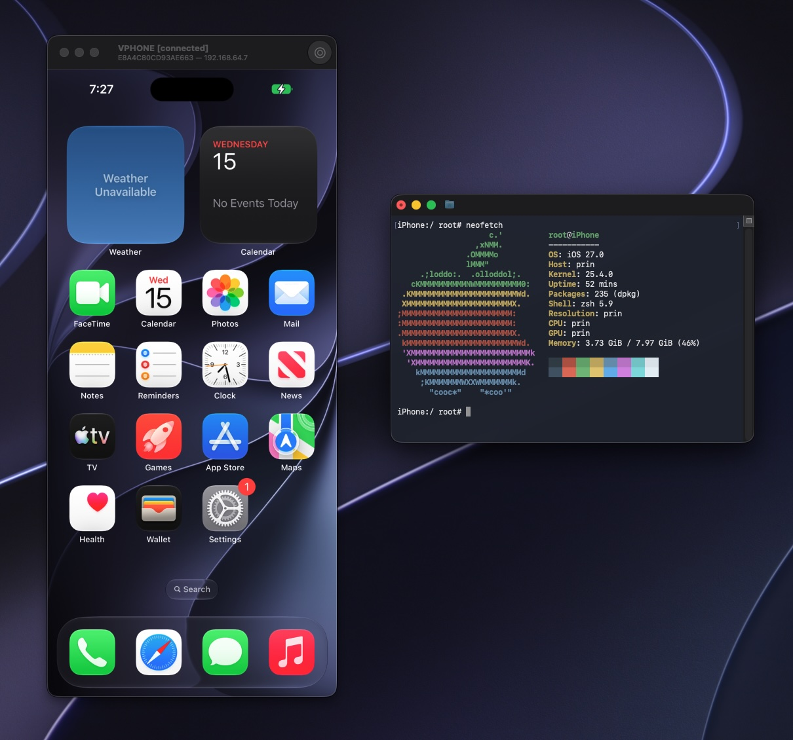

<div align="right"><strong><a href="./docs/README_ko.md">🇰🇷한국어</a></strong> | <strong><a href="./docs/README_ja.md">🇯🇵日本語</a></strong> | <strong><a href="./docs/README_zh.md">🇨🇳中文</a></strong> | <strong>🇬🇧English</strong></div>

# vphone-cli

Boot a virtual iPhone (iOS 26) via Apple's Virtualization.framework using PCC research VM infrastructure.



## Tested Environments

| Host          | iPhone                | CloudOS       |
| ------------- | --------------------- | ------------- |
| Mac16,12 26.3 | `17,3_26.1_23B85`     | `26.1-23B85`  |
| Mac16,12 26.3 | `17,3_26.3_23D127`    | `26.1-23B85`  |
| Mac16,12 26.3 | `17,3_26.3_23D127`    | `26.3-23D128` |
| Mac16,12 26.3 | `17,3_26.3.1_23D8133` | `26.3-23D128` |

## Firmware Variants

Three patch variants are available with increasing levels of security bypass:

| Variant         | Boot Chain  |    CFW    | Make Targets                       |
| --------------- | :---------: | :-------: | ---------------------------------- |
| **Regular**     | 0 patches  | 10 phases | `fw_patch` + `cfw_install`         |
| **Development** | 52 patches  | 12 phases | `fw_patch_dev` + `cfw_install_dev` |
| **Jailbreak**   | 112 patches | 14 phases | `fw_patch_jb` + `cfw_install_jb`   |

> JB finalization (symlinks, Sileo, apt, TrollStore) runs automatically on first boot via `/cores/vphone_jb_setup.sh` LaunchDaemon. Monitor progress: `/var/log/vphone_jb_setup.log`.

See [research/0_binary_patch_comparison.md](./research/0_binary_patch_comparison.md) for the detailed per-component breakdown.

## Prerequisites

**Host OS:** macOS 15+ (Sequoia) is required for PV=3 virtualization.

**Configure SIP/AMFI** — required for private Virtualization.framework entitlements and unsigned binary workflows.

Boot into Recovery (long press power button), open Terminal, then choose one setup path:

- **Option 1: Fully disable SIP + AMFI boot-arg (most permissive)**

  In Recovery:

  ```bash
  csrutil disable
  csrutil allow-research-guests enable
  ```

  After restarting into macOS:

  ```bash
  sudo nvram boot-args="amfi_get_out_of_my_way=1 -v"
  ```

  Restart once more.

- **Option 2: Keep SIP mostly enabled, disable only debug restrictions, use [`amfidont`](https://github.com/zqxwce/amfidont) or [`amfree`](https://github.com/retX0/amfree)**

  In Recovery:

  ```bash
  csrutil enable --without debug
  csrutil allow-research-guests enable
  ```

  After restarting into macOS:

  ```bash
  # Using amfidont:
  xcrun python3 -m pip install amfidont
  sudo amfidont --path [PATH_TO_VPHONE_DIR]
  
  # OR Using amfree:
  brew install retX0/tap/amfree
  sudo amfree --path [PATH_TO_VPHONE_DIR]
  ```

  Repo helper (for amfidont):

  ```bash
  make amfidont_allow_vphone
  ```

  This helper computes the current signed `vphone-cli` CDHash and uses the
  URL-encoded project path form observed by `AMFIPathValidator`.

**Install dependencies:**

```bash
brew install aria2 wget gnu-tar openssl@3 ldid-procursus sshpass keystone libusb ipsw
```

`scripts/fw_prepare.sh` prefers `aria2c` for faster multi-connection downloads and falls back to `curl` or `wget` when needed.

**Submodules** — this repo uses git submodules for resources, vendored Swift deps, and toolchain sources under `scripts/repos/`. Clone with:

```bash
git clone --recurse-submodules https://github.com/Lakr233/vphone-cli.git
```

## Quick Start

```bash
make setup_machine            # full automation through "First Boot" (includes restore/ramdisk/CFW)
# options: NONE_INTERACTIVE=1 SUDO_PASSWORD=... 
# DEV=1 for dev variant (+ TXM entitlement/debug bypasses)
# JB=1 for jailbreak variant (+ full security bypass)
```

## Manual Setup

```bash
make setup_tools              # install brew deps, build trustcache + insert_dylib, create Python venv (pymobiledevice3, aria2c included)
make build                    # build + sign vphone-cli
make vm_new                   # create VM directory with manifest (config.plist)
# options: CPU=8 MEMORY=8192 DISK_SIZE=64
make fw_prepare               # download IPSWs, extract, merge, generate manifest
make fw_patch                 # patch boot chain (regular variant)
# or: make fw_patch_dev       # dev variant (+ TXM entitlement/debug bypasses)
# or: make fw_patch_jb        # jailbreak variant (+ full security bypass)
```

### VM Configuration

Starting from v1.0, VM configuration is stored in `vm/config.plist`. Set CPU, memory, and disk size during VM creation:

```bash
# Create VM with custom configuration
make vm_new CPU=16 MEMORY=16384 DISK_SIZE=128

# Boot automatically reads from config.plist
make boot
```

The manifest stores all VM settings (CPU, memory, screen, ROMs, storage) and is compatible with [security-pcc's VMBundle.Config format](https://github.com/apple/security-pcc).

## Restore

You'll need **two terminals** for the restore process. Keep terminal 1 running while using terminal 2.

```bash
# terminal 1
make boot_dfu                 # boot VM in DFU mode (keep running)
```

```bash
# terminal 2
make restore_get_shsh         # fetch SHSH blob
make restore                  # flash firmware via pymobiledevice3 restore backend
```

## Install Custom Firmware

Stop the DFU boot in terminal 1 (Ctrl+C), then boot into DFU again for the ramdisk:

```bash
# terminal 1
make boot_dfu                 # keep running
```

```bash
# terminal 2
sudo make ramdisk_build       # build signed SSH ramdisk
make ramdisk_send             # send to device
```

Once the ramdisk is running (you should see `Running server` in the output), open a **third terminal** for the usbmux tunnel, then install CFW from terminal 2:

```bash
# terminal 3 — keep running
python3 -m pymobiledevice3 usbmux forward 2222 22
```

```bash
# terminal 2
make cfw_install
# or: make cfw_install_jb        # jailbreak variant
```

## First Boot

Stop the DFU boot in terminal 1 (Ctrl+C), then:

```bash
make boot
```

After `cfw_install_jb`, the jailbreak variant will have **Sileo** and **TrollStore** available on first boot. You can use Sileo to install `openssh-server` for SSH access.

For the regular/development variant, the VM gives you a **direct console**. When you see `bash-4.4#`, press Enter and run these commands to initialize the shell environment and generate SSH host keys:

```bash
export PATH='/usr/local/sbin:/usr/local/bin:/usr/sbin:/usr/bin:/sbin:/bin:/usr/bin/X11:/usr/games:/iosbinpack64/usr/local/sbin:/iosbinpack64/usr/local/bin:/iosbinpack64/usr/sbin:/iosbinpack64/usr/bin:/iosbinpack64/sbin:/iosbinpack64/bin'

mkdir -p /var/dropbear
cp /iosbinpack64/etc/profile /var/profile
cp /iosbinpack64/etc/motd /var/motd

# generate SSH host keys (required for SSH to work)
dropbearkey -t rsa -f /var/dropbear/dropbear_rsa_host_key
dropbearkey -t ecdsa -f /var/dropbear/dropbear_ecdsa_host_key

shutdown -h now
```

> **Note:** Without the host key generation step, dropbear (SSH server) will accept connections but immediately close them because it has no keys to perform the SSH handshake.

## Subsequent Boots

```bash
make boot
```

In a separate terminal, start usbmux forward tunnels:

```bash
python3 -m pymobiledevice3 usbmux forward 2222 22222    # SSH (dropbear)
python3 -m pymobiledevice3 usbmux forward 2222 22       # SSH (JB: if you install openssh-server from Sileo)
python3 -m pymobiledevice3 usbmux forward 5901 5901     # VNC
python3 -m pymobiledevice3 usbmux forward 5910 5910     # RPC
```

Connect via:

- **SSH (JB):** `ssh -p 2222 mobile@127.0.0.1` (password: `alpine`)
- **SSH (Regular/Dev):** `ssh -p 2222 root@127.0.0.1` (password: `alpine`)
- **VNC:** `vnc://127.0.0.1:5901`
- [**RPC:**](http://github.com/doronz88/rpc-project) `rpcclient -p 5910 127.0.0.1`

## VM Backup & Switch

Save and switch between multiple VM environments (e.g. different iOS builds or firmware variants). Backups are stored in `vm.backups/` using `rsync --sparse` for efficient sparse disk handling.

```bash
make vm_backup NAME=26.1-clean    # save current VM
rm -rf vm && make vm_new          # start fresh for a different build
# ... fw_prepare, fw_patch, restore, cfw_install, boot
make vm_backup NAME=26.3-jb       # save the new one too
make vm_list                      # list all saved backups
make vm_switch NAME=26.1-clean    # swap between them
```

> **Note:** Always stop the VM before backup/switch/restore.

## FAQ

> **Before anything else — run `git pull` to make sure you have the latest version.**

**Q: I get `zsh: killed ./vphone-cli` when trying to run it.**

AMFI/debug restrictions are not bypassed correctly. Choose one setup path:

- **Option 1 (full AMFI disable):**

  ```bash
  sudo nvram boot-args="amfi_get_out_of_my_way=1 -v"
  ```

- **Option 2 (debug restrictions only):**
  use Recovery mode `csrutil enable --without debug` (no full SIP disable), then install/load [`amfidont`](https://github.com/zqxwce/amfidont) or [`amfree`](https://github.com/retX0/amfree) while keeping AMFI otherwise enabled.
  For this repo, `make amfidont_allow_vphone` packages the required encoded-path
  and CDHash allowlist startup (if using amfidont).

**Q: `make boot` / `make boot_dfu` starts and then fails with `VZErrorDomain Code=2 "Virtualization is not available on this hardware."`**

The host itself is running inside an Apple virtual machine, so nested
Virtualization.framework guest boot is unavailable. Run the boot flow on a
non-nested macOS 15+ host instead. `make boot_host_preflight` will show this as
`Model Name: Apple Virtual Machine 1` with `kern.hv_vmm_present=1`.
`make boot` / `make boot_dfu` now fail fast through `boot_binary_check` before
attempting VM startup on that kind of host.

**Q: System apps (App Store, Messages, etc.) won't download or install.**

During iOS setup, do **not** select **Japan** or **European Union** as your region. These regions enforce additional regulatory checks (e.g., sideloading disclosures, camera shutter requirements) that the virtual machine cannot satisfy, which prevents system apps from being downloaded and installed. Choose any other region (e.g., United States) to avoid this issue.

**Q: I'm stuck on the "Press home to continue" screen.**

Connect via VNC (`vnc://127.0.0.1:5901`) and right-click anywhere on the screen (two-finger click on a Mac trackpad). This simulates the home button press.

**Q: How do I get SSH access?**

Install `openssh-server` from Sileo (available on the jailbreak variant after first boot).

**Q: SSH doesn't work after installing openssh-server.**

Reboot the VM. The SSH server will start automatically on the next boot.

**Q: Can I install `.tipa` files?**

Yes. The install menu supports both `.ipa` and `.tipa` packages. Drag and drop or use the file picker.

**Q: Can I update to a newer iOS version?**

Yes. Override `fw_prepare` with the IPSW URL for the version you want:

```bash
export IPHONE_SOURCE=/path/to/some_os.ipsw
export CLOUDOS_SOURCE=/path/to/some_os.ipsw
make fw_prepare
make fw_patch
```

Our patches are applied via binary analysis, not static offsets, so newer versions should work. If something breaks, ask AI for help.

## Automation

vphone-cli exposes a host control socket (`vm/vphone.sock`) for programmatic VM interaction — screenshots, touch injection, swipe gestures, hardware keys, and clipboard. Every action returns a compact grayscale screenshot inline, enabling AI-driven E2E testing workflows.

See [vphone-mcp](https://github.com/pluginslab/vphone-mcp) for an MCP server that wraps this socket with high-level tools (open apps by name, navigate back, scroll, type text) usable from Claude Code or Claude Desktop.

## Acknowledgements

- [wh1te4ever/super-tart-vphone-writeup](https://github.com/wh1te4ever/super-tart-vphone-writeup)
